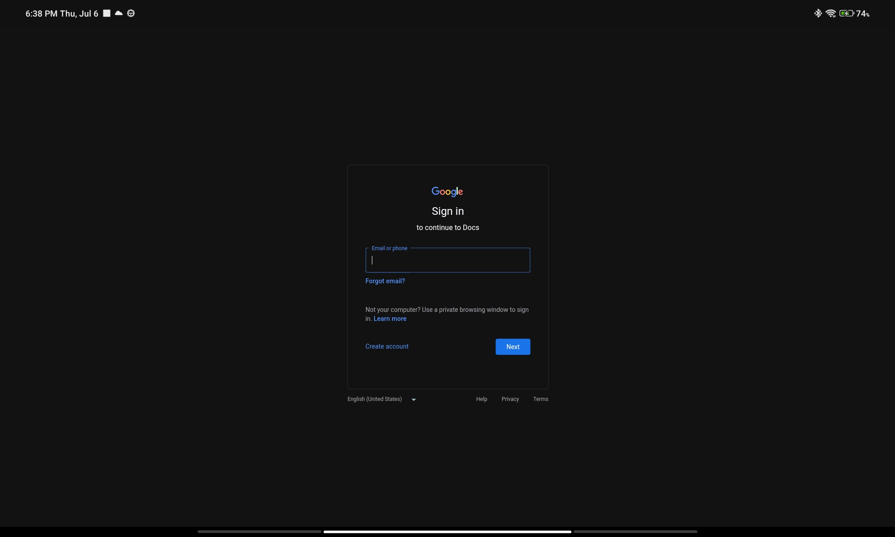

# Google Docs, Sheets & Slides (Desktop Mode) for Android
GDocsDesk is simple WebView wrapper for accessing Google Docs, Sheets and Slides web-apps on Android Tablets. Credential for auth is separated from Android google account, so you should sign in manually inside apps.

This apps is only simple browser wrapper without any extended touch support, and only reccommended for tablet with keyboard and mouse/trackpad.

### Screenshot

